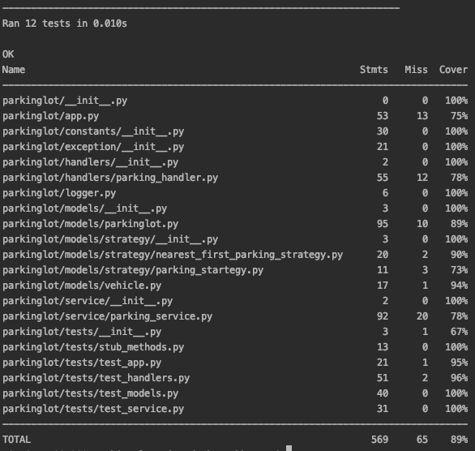

# ParkingLot v1.4.2 | Virender Bhargav

## 1. Problem Statment
I own a parking lot that can hold up to 'n' cars at any given point in time. Each slot is given a number starting at 1 increasing with increasing distance from the entry point in steps of one.
I want to create an automated ticketing system that allows my customers to use my parking lot without human intervention.
When a car enters my parking lot, I want to have a ticket issued to the driver. The ticket issuing process includes us documenting the registration number (number plate) and the colour of the car and allocating an available parking slot to the car before actually handing over a ticket to the driver.
The customer should be allocated a parking slot which is nearest to the entry. At the exit the customer returns the ticket which then marks the slot they were using as being available.
- - - -

## 2. Solution Approach
* ParkingService: Interface that defines operations supported by Parking System
* ParkingHandler - Interface for validation and execution of commands
* ParkingStrategy - Interface for parking strategy used to park vehicles
* NearestFirstParkingStrategy - Parking Strategy Implementation: uses OrderDict() to store available parking slots
                                in increasing orders of closeness to entrance
* ParkingLot : Singleton Class to ensure only one object of ParkingLot in the system. Model to store:
    * capacity
    * availability 
    * parking_strategy
    * slot_vehicle_map : Mapping of parking slots and corresponding parked vehicle
- - - -

## 3. Supported Commands

- ***`create_parking_lot` <`n`>***
    * create a parking lot capacity `n`

- ***`park` <`registration_number`> <`colour`>*** 
    * park the vehicle of given registration number and color according to parking strategy and return allocated slot
    * show apt message if parking is full
    * show apt message if vehicle is already parked

- ***`leave` <`slot`>*** 
    * empties given slot and make it available for parking
    * show apt message if parking lot is empty
    * show apt message is slot is already vacant 

- ***`status`***    
    * show current status of Parking Lot

- ***`slot_numbers_for_cars_with_colour` <`colour`>***
    * show  slots of all parked cars having given color

- ***`slot_number_for_registration_number` <`registration_number`>***   
    * show slot number of the parked car of given registration number

- ***`registration_numbers_for_cars_with_colour` <`colour`>***   
    * show registration number of all parked cars having given color
- - - -

## 4. Install and Run 
#### 4.1 Install and build

`./bin/setup`

#### 4.2 Running the application in Interactive mode:

`./bin/parking_lot`

#### 4.5 Running the application in File Input mode:

`./bin/parking_lot <file_name/file_path>`
- - - -

## 5. Test Cases

#### 5.1 To run all test cases

`python3 -m unittest discover -s tests -t parkinglot`

#### 5.2 For calculating code coverage
`coverage run --source parkinglot -m unittest discover && coverage report`

- - - -